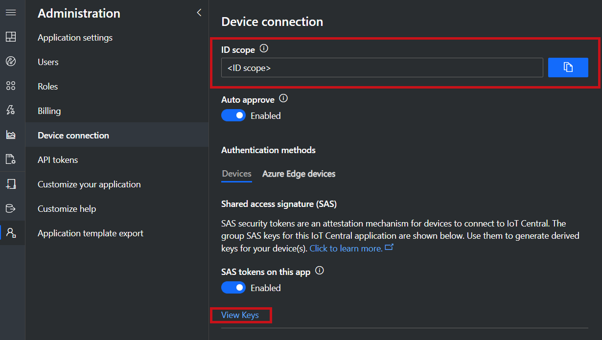
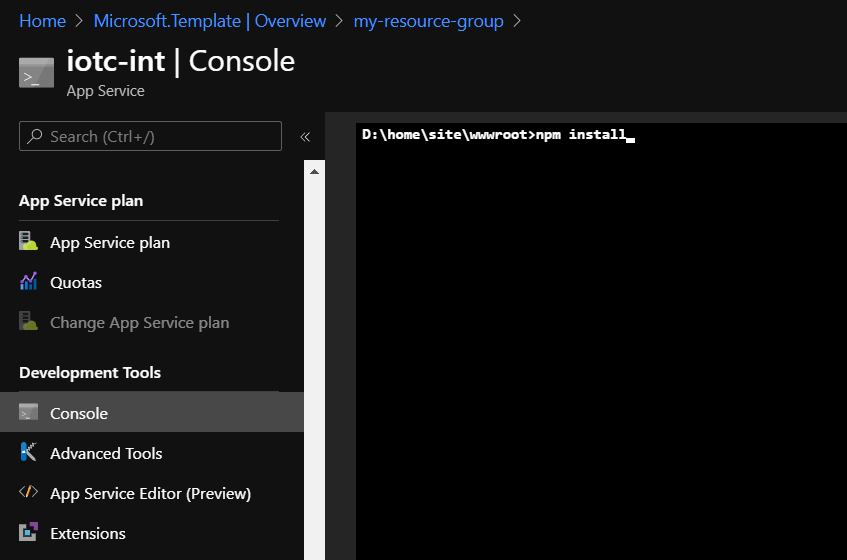
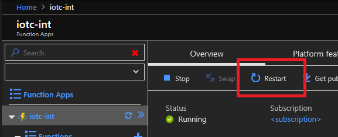
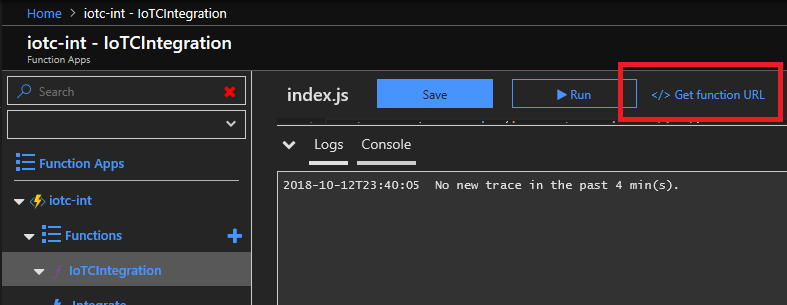

# Azure IoT Central Device Bridge

This repository contains everything you need create a device bridge to connect other IoT clouds such as Sigfox, Particle, and The Things Network (TTN) to IoT Central. The device bridge forwards the messages your devices send to other clouds to your IoT Central app. In your IoT Central app, you can build rules and run analytics on that data, create workflows in Microsoft Flow and Azure Logic apps, export that data, and much more. This solution will provision several Azure resources into your Azure subscription that work together to transform and forward device messages through a webhook integration in Azure Functions.

To use the device bridge solution, you will need the following:

- an Azure account. You can create a free Azure account from [here](https://aka.ms/aft-iot)
- an Azure IoT Central application to connect the devices. Create a free app by following [these instructions](https://docs.microsoft.com/en-us/azure/iot-central/quick-deploy-iot-central)

[](https://portal.azure.com/#create/Microsoft.Template/uri/https%3A%2F%2Fraw.githubusercontent.com%2Fjasonv-overhaul%2Fiotc-device-bridge%2Fmaster%2Fazuredeploy.json)

## Instructions

Take the following steps to deploy an Azure Function into your subscription and set up the device bridge.

1. Click the `Deploy to Azure` button above. This opens up a custom ARM template in the Azure Portal to deploy the Azure Function.

2. Go to your IoT Central application, and navigate to the `Administration > Device Connection` area.

- Copy the `ID Scope` and paste it into the `Scope ID` field the custom template.
- In the same page, under the `Devices` tab, click `View Keys`. Copy either the `Primary key` or the `Secondary key` and paste it into the `Iot Central SAS Key` field. (this key will be stored in a Key Vault
  provisioned with the function).



3. After the deployment is done, install the required NPM packages in the function. To do this,
   open the App Service that was deployed to your subscription, then navigate to the `Development Tools > Console` section.
   In the console, navigate to the function directory by running the command `cd IoTCIntegration`. Once in the correct directory, run the command `npm install` (this command takes ~20 minutes to complete, so feel free to do something else in that time).
   NPM warning messages (starting with `npm WARN`) will not prevent the successful execution of the command.



4. After the package installation finishes, the App Service needs to be restarted by clicking the
   `Restart` button in `Overview` page.



5. The function is now ready to use. External systems can feed device data through this device bridge and into your IoT Central app by making HTTP POST requests to the function URL. The URL can be obtained in the newly created function in `Functions > IoTCIntegration > Code + Test > Get function URL`.



Messages sent to the device bridge must have the following format in the body:

```json
{
  "device": {
    "deviceId": "my-cloud-device"
  },
  "measurements": {
    "temp": 20.31,
    "pressure": 50,
    "humidity": 8.5,
    "ledColor": "blue"
  }
}
```

Each key in the `measurements` object must match the name of a capability in the device template in the IoT Central application.
Because this solution doesn't support specifying the interface Id in the message body, if two different interfaces
have a capability with the same name, the measurement will be presented in both capabilities.
For legacy applications (2018), the keys in the `measurements` object must match the measurement field names in the Azure IoT Central application.

An optional `timestamp` field can be included in the body, to specify the UTC date and time of the message.
This field must be in ISO format: YYYY-MM-DDTHH:mm:ss.sssZ (for example, `2020-06-08T20:16:54.602Z` is a valid timestamp). If `timestamp` is not provided,
the current date and time will be used.

> NOTE: `deviceId` must be alphanumeric, lowercase, and may contain hyphens.

6. When a message with a new `deviceId` is sent to IoT Central by the device bridge, a new _unassociated device_ will be created.
   The device will initially be under `Devices > All devices`. Select the device then click `migrate` to choose the appropriate template.


- **Legacy applications (2018):** the new device will appear in your IoT Central application in `Device Explorer > Unassociated devices`. Click `Associate` and choose a device template to start receiving incoming measurements from that device in IoT Central.


> NOTE: Until the device is associated to a template, HTTP calls to the function will return a 403 error status.

7. Optionally, logging can be enabled using Application Insights. To do so, in the newly created App Service, navigate to `Monitoring > App Service logs`,
   then click `Turn on Application Insights`. Once enabled, logs will be saved for future executions of the function.

## What is being provisioned? (pricing)

The custom template in this repository will provision the following Azure resources:

- Key Vault, needed to store your IoT Central key
- Storage Account
- Function App
- Consumption Plan

The Function App runs on a [consumption plan](https://azure.microsoft.com/en-us/pricing/details/functions/).
While this option does not offer dedicated compute resources, it allows device bridge to handle
**hundreds of device messages per minute**, suitable for smaller fleets of devices or devices that send messages less frequently.
If your application depends on streaming a large number of device messages, you may choose to replace the
consumption plan by dedicated a [App Service Plan](https://azure.microsoft.com/en-us/pricing/details/app-service/windows/).
This plan offers dedicated compute resources, which leads to faster server response times.
Using a standard App Service Plan, the maximum observed performance of the Azure Function in this repository was around
**1,500 device messages per minute**. You can learn more about the [Azure Function hosting options
in documentation](https://docs.microsoft.com/en-us/azure/azure-functions/functions-scale).

To use a dedicated App Service Plan instead of a consumption plan, edit the custom template before deploying. Click the `Edit template` button.


Replace the segment

```json
{
  "type": "Microsoft.Web/serverfarms",
  "apiVersion": "2015-04-01",
  "name": "[variables('planName')]",
  "location": "[resourceGroup().location]",
  "properties": {
    "name": "[variables('planName')]",
    "computeMode": "Dynamic",
    "sku": "Dynamic"
  }
},
```

with

```json
{
  "type": "Microsoft.Web/serverfarms",
  "sku": {
      "name": "S1",
      "tier": "Standard",
      "size": "S1",
      "family": "S",
      "capacity": 1
  },
  "kind": "app",
  "name": "[variables('planName')]",
  "apiVersion": "2016-09-01",
  "location": "[resourceGroup().location]",
  "tags": {
      "iotCentral": "device-bridge",
      "iotCentralDeviceBridge": "app-service-plan"
  },
  "properties": {
      "name": "[variables('planName')]"
  }
},
```

Additionally, edit the template to include `"alwaysOn": true` in the configurations of the Function App resource (under `properties > siteConfig`, right before `appSettings`). The [alwaysOn configuration](https://github.com/Azure/Azure-Functions/wiki/Enable-Always-On-when-running-on-dedicated-App-Service-Plan) ensures that the function app is running at all times.

## Example 1: Connecting Particle devices through the device bridge

To connect a Particle device through the device bridge to IoT Central, go to the Particle console and create a new webhook integration. Set the `Request Format` to `JSON` and, under `Advanced Settings`, use the following custom body format:

```
{
  "device": {
    "deviceId": "{{{PARTICLE_DEVICE_ID}}}"
  },
  "measurements": {
    "{{{PARTICLE_EVENT_NAME}}}": {{{PARTICLE_EVENT_VALUE}}}
  }
}

```

Paste in the function URL from your Azure Function, and you should see Particle devices appear as unassociated devices in IoT Central. For additional details, see [this blog post](https://blog.particle.io/2019/09/26/integrate-particle-with-azure-iot-central/) by the Particle team.

## Example 2: Connecting Sigfox devices through the device bridge

Some platforms may not allow you to specify the format of device messages sent through a
webhook. For such systems, the message payload must be converted to the expected body format
before it can be processed by the device bridge. This conversion can be performed in the same
Azure Function that runs the device bridge.

In this section, we demonstrate this concept by showing how the payload of a Sigfox webhook
integration can be converted to the body format expected by this solution. Device data is
transmitted from the Sigfox cloud in a hexadecimal string format. For convenience, we have
provided a conversion function for this format, which accepts a subset of the possible
field types in a Sigfox device payload (`int` and `uint` of 8, 16, 32, or 64 bits;
`float` of 32 or 64 bits; `little-endian` and `big-endian`). To process messages from a
Sigfox webhook integration, the following changes are needed to the `IoTCIntegration/index.js`
file of the Function App:

- To convert the message payload, add the following code **before** the call to `handleMessage`
  in line 21 (replacing `payloadDefinition` by your Sigfox payload definition):

```javascript
const payloadDefinition = "gforce::uint:8 lat::uint:8 lon::uint:16"; // Replace this with your payload definition

req.body = {
  device: {
    deviceId: req.body.device,
  },
  measurements: require("./converters/sigfox")(
    payloadDefinition,
    req.body.data
  ),
};
```

- Sigfox devices expect a `204` response code. To do this, add the following code snippet
  **after** the call to `handleMessage` in line 21:

```javascript
context.res = {
  status: 204,
};
```

## Example 3: Connecting devices from The Things Network through the device bridge

Devices in The Things Network (TTN) can be easily connected to IoT Central through this solution.
To do so, add a new HTTP integration to you application in The Things Network console (`Application > Integrations > add integration > HTTP Integration`).
Also make sure that your application has a decoder function defined (`Application > Payload Functions > decoder`),
so the payload of your device messages can be automatically converted to JSON before being sent to
the Azure Function. In the following sample, we show a JavaScript decoder function that can be used
to decode common numeric types from binary data.

```javascript
function Decoder(bytes, port) {
  function bytesToFloat(bytes, decimalPlaces) {
    var bits = (bytes[3] << 24) | (bytes[2] << 16) | (bytes[1] << 8) | bytes[0];
    var sign = bits >>> 31 === 0 ? 1.0 : -1.0;
    var e = (bits >>> 23) & 0xff;
    var m = e === 0 ? (bits & 0x7fffff) << 1 : (bits & 0x7fffff) | 0x800000;
    var f =
      Math.round(
        sign * m * Math.pow(2, e - 150) * Math.pow(10, decimalPlaces)
      ) / Math.pow(10, decimalPlaces);
    return f;
  }

  function bytesToInt32(bytes, signed) {
    var bits = bytes[0] | (bytes[1] << 8) | (bytes[2] << 16) | (bytes[3] << 24);
    var sign = 1;

    if (signed && bits >>> 31 === 1) {
      sign = -1;
      bits = bits & 0x7fffffff;
    }

    return bits * sign;
  }

  function bytesToShort(bytes, signed) {
    var bits = bytes[0] | (bytes[1] << 8);
    var sign = 1;

    if (signed && bits >>> 15 === 1) {
      sign = -1;
      bits = bits & 0x7fff;
    }

    return bits * sign;
  }

  return {
    temperature: bytesToFloat(bytes.slice(0, 4), 2),
    presscounter: bytesToInt32(bytes.slice(4, 8), true),
    blueLux: bytesToShort(bytes.slice(8, 10), false),
  };
}
```

After the integration has been defined, add the following code **before** the call to `handleMessage`
in line 21 of the `IoTCIntegration/index.js` file of your Azure Function. This will translate
the body of your HTTP integration to the expected format.

```javascript
req.body = {
  device: {
    deviceId: req.body.hardware_serial.toLowerCase(),
  },
  measurements: req.body.payload_fields,
};
```

## Limitations

This device bridge only forwards messages to IoT Central, and does not send messages back to devices. Due to the unidirectional nature of this solution, `settings` and `commands` will **not** work for devices that connect to IoT Central through this device bridge. Because device twin operations are also not supported, it's **not** possible to update `device properties` through this setup. To use these features, a device must be connected directly to IoT Central using one of the [Azure IoT device SDKs](https://docs.microsoft.com/en-us/azure/iot-hub/iot-hub-devguide-sdks).

## Package integrity

The template provided here deploys a packaged version of the code in this repository to an Azure
Function. You can check the integrity of the code being deployed by verifying that the `SHA256` hash
of the `iotc-bridge-az-function.zip` file in the root of this repository matches the following:

```
510D3252A7DC37F0D07A34A93D09B976BFAF91F13E0E723CCD2A85C1ACC4524E
```

# Contributing

This project welcomes contributions and suggestions. Most contributions require you to agree to a
Contributor License Agreement (CLA) declaring that you have the right to, and actually do, grant us
the rights to use your contribution. For details, visit https://cla.microsoft.com.

When you submit a pull request, a CLA-bot will automatically determine whether you need to provide
a CLA and decorate the PR appropriately (e.g., label, comment). Simply follow the instructions
provided by the bot. You will only need to do this once across all repos using our CLA.

This project has adopted the [Microsoft Open Source Code of Conduct](https://opensource.microsoft.com/codeofconduct/).
For more information see the [Code of Conduct FAQ](https://opensource.microsoft.com/codeofconduct/faq/) or
contact [opencode@microsoft.com](mailto:opencode@microsoft.com) with any additional questions or comments.
